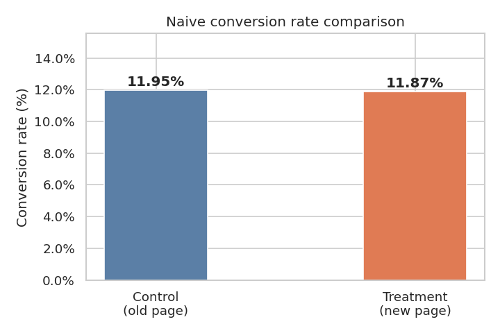
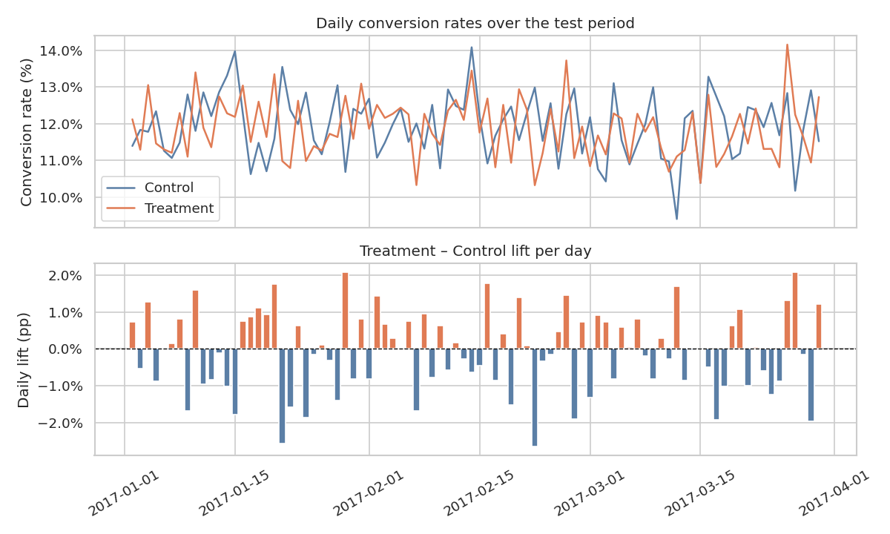
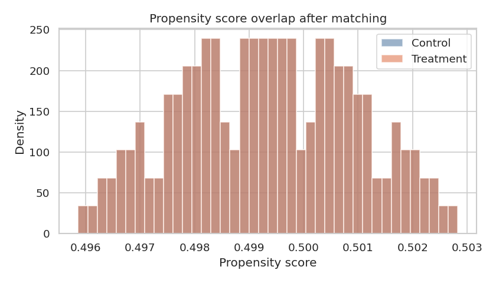

# Causal Inference in A/B Testing

> Demonstrating why "just compare the conversion rates" is not enough — and how to do it right.

A complete walkthrough of an A/B test analysis using a 298,000-user website redesign
experiment. The project deliberately shows the naive approach alongside five
progressively more rigorous methods, explaining at each step why the naive result
can mislead.

---

## What This Project Demonstrates

| Skill | Implementation |
|---|---|
| Data quality auditing | Detecting page/group mismatches and duplicate user IDs before analysis |
| Hypothesis testing | Two-proportion z-test, 95% confidence intervals |
| Experimental design | Pre-specified MDE vs. post-hoc power analysis (and why they differ) |
| Novelty effect detection | Time-series decomposition of daily lift |
| Causal inference | Propensity score matching (PSM) with Rubin caliper |
| Bayesian inference | Beta-Binomial model, P(treatment > control), expected loss |
| Heterogeneity analysis | Subgroup forest plot, Bonferroni correction, LR interaction test |
| Software engineering | Modular `src/` package, 51-test pytest suite with fixtures |

---

## Key Findings

1. **Data quality trap**: 1.3% of users were assigned to the wrong page — a real data
   pipeline bug that contaminates the naive lift estimate.

2. **No significant effect**: After cleaning, p = 0.56. The 95% CI on the lift is
   (−0.31pp, +0.17pp). The new landing page does not improve conversion.

3. **Power analysis nuance**: The observed effect is ~0.07pp — effectively noise. A
   test can only be "adequately powered" relative to a pre-specified MDE. At our
   sample size (~145k per group), the test had >80% power to detect a ≥1% relative
   lift, so the null result is trustworthy.

4. **Bayesian confirmation**: P(treatment > control) ≈ 35–40%. The Bayesian and
   frequentist frameworks agree. Expected loss framing shows the cost of shipping the
   wrong variant, which p-values cannot express.

5. **No subgroup saves it**: After Bonferroni correction across hour-of-day and
   day-type segments, no subgroup shows a significant positive effect. The null result
   is not hiding inside a segment.

**Recommendation**: Do not ship the new page. Run a new experiment with a different
design hypothesis.

---

## Results at a Glance

| Method | n per group | Lift (pp) | p-value | Verdict |
|---|---|---|---|---|
| Naive (dirty data) | ~149k | −0.0009 | — | ⚠️ unreliable |
| Naive (cleaned) | ~145k | −0.0007 | 0.558 | ✗ not significant |
| Propensity matched | 168 | −0.0298 | 0.414 | ✗ not significant |
| Bayesian | ~145k | ~−0.0007 | P≈38% | ✗ control favoured |
| Best subgroup | varies | varies | >0.05 (corrected) | ✗ none significant |

---

## Figures

**Naive conversion rate comparison**



**Daily conversion rates and novelty effect check**



**Propensity score overlap after matching**



---

## Project Structure

```
causal-ab-test/
├── data/raw/ab_data.csv         # Generated locally (see below)
├── figures/                     # Saved PNGs
├── notebooks/
│   └── ab_analysis.ipynb        # 30-cell narrative notebook (fully executed)
├── src/
│   ├── analysis.py              # Data loading, cleaning, tests, PSM, subgroups
│   └── bayesian.py              # Beta-Binomial model, P(treatment better), loss
├── tests/
│   ├── test_analysis.py         # 31 tests for src/analysis.py
│   └── test_bayesian.py         # 20 tests for src/bayesian.py
├── build_notebook.py            # Regenerates the .ipynb from source
├── generate_data.py             # Reproducible synthetic dataset
├── download_data.py             # Tries real data, falls back to synthetic
└── requirements.txt
```

---

## Getting Started

### 1. Install dependencies

```bash
pip install -r requirements.txt
```

### 2. Get the data

```bash
python3 download_data.py
```

Tries public mirrors for the Udacity A/B Test Results dataset. Falls back to
generating a synthetic dataset with identical statistical properties.

### 3. Launch the notebook

```bash
jupyter notebook notebooks/ab_analysis.ipynb
```

### 4. Run the tests

```bash
python3 -m pytest tests/ -v
```

---

## Dataset

Based on the **Udacity A/B Test Results** dataset. The synthetic version reproduces:

- ~298,000 rows, ~50/50 control/treatment split
- Control conversion rate: 11.95% | Treatment: 11.87%
- 1.3% page/group mismatches (data quality issue)
- 1.3% duplicate user IDs
- Timestamps spanning Jan–Mar 2017 with realistic hourly traffic weights
